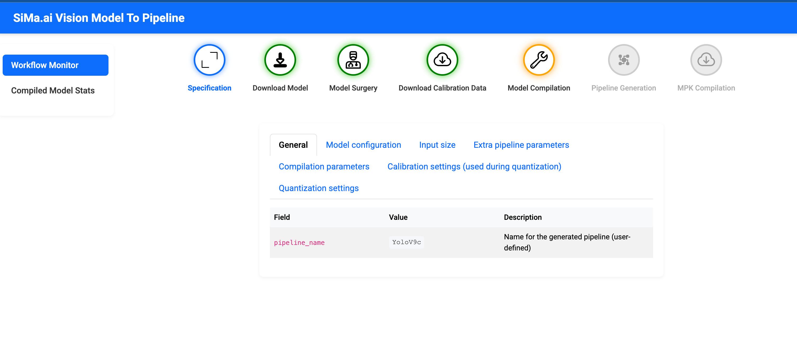
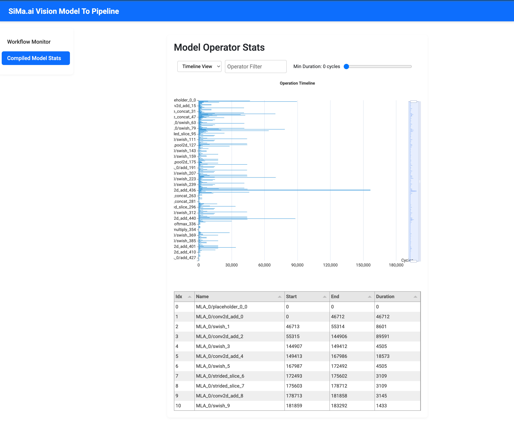

## model-to-pipeline

**model-to-pipeline** is a two-stage workflow that converts an FP32 model into a deployable pipeline executable for **SiMa hardware**.

- **Stage 1**: Quantize and compile the model inside the **Model SDK container**.
- **Stage 2**: Package and build the deployable **pipeline binary (MPK)**.

The workflow is driven by a YAML-based configuration file.

### Running the workflow

```sh
host-pc$ cd ~/workspace/tool-model-to-pipeline && source .venv/bin/activate
host-pc$ python3 model-to-pipeline/run.py samples/yolov9c/yolov9c.yaml
```

This command starts a monitoring web application on the host machine.
Access the monitor at:
```sh
http://<host-ip>:5000
```

The monitor provides real-time visibility into model retrieval, quantization, compilation, and pipeline build progress.

To use a different port for the monitoring service, specify the port explicitly:

```sh
host-pc$ cd ~/workspace/tool-model-to-pipeline
host-pc$ python3 model-to-pipeline/run.py samples/yolov9c/yolov9c.yaml -p 5001
```

See the following screenshots for reference.



Once model compilation step is completed, user can view the operator cycle stats in the following view.



## Run individual stages

Alternatively, the developer can run individual stages by going directly into the respective SDK container.

First, start the monitor session and open http://host:5000 in the browser.

```sh
host-pc$ cd ~/workspace/tool-model-to-pipeline && source .venv/bin/activate
host-pc$ python3 model-to-pipeline/monitor/app.py
```

**Running quantization and compilation stage**

```sh
host-pc:~$ sima-cli sdk model
⚠️  You have disabled update check with SIMA_CLI_CHECK_FOR_UPDATE environment variable, skipping sima-cli update check..
🔧 Environment: host (linux)
🖥️  Detected platform: Linux
✅ Docker daemon is running.
▶ Executing command in container: vdp-cli-modelsdk-2.1.0_palette_sdk_master_b279
=============================================================
 🚀 Welcome to the ModelSDK Container 
 
 ⚠️  IMPORTANT NOTICE:
 Please keep all your work in the mounted path:
     /home/docker/sima-cli 
 to avoid losing files if the container is removed accidentally.
=============================================================
user@vdp-cli-modelsdk:/home/docker/sima-cli$ cd tool-model-to-pipeline/
user@vdp-cli-modelsdk:/home/docker/sima-cli/tool-model-to-pipeline$ sima-model-to-pipeline model-to-pipeline --config-yaml samples/yolov8m/yolov8m.yaml 

```

**Running pipeline building stage**

```sh
host-pc:~/workspace$ sima-cli sdk mpk
🔧 Environment: host (linux)
🖥️  Detected platform: Linux
✅ Docker daemon is running.
▶ Executing command in container: vdp-cli-mpk_cli_toolset-2.1.0_palette_sdk_master_b279
=============================================================
 🚀 Welcome to the Palette SDK Container 
 
 ⚠️  IMPORTANT NOTICE:
 Please keep all your work in the mounted path:
     /home/docker/sima-cli 
 to avoid losing files if the container is removed accidentally.
=============================================================
user@vdp-cli-mpk_cli_toolset:/home/docker/sima-cli$ cd tool-model-to-pipeline/
yser@vdp-cli-mpk_cli_toolset:/home/docker/sima-cli/tool-model-to-pipeline$ sima-model-to-pipeline model-to-pipeline  --config-yaml samples/yolov8m/yolov8m.yaml
```

## Command line options

Alternatively, without using yaml file, the developer can directly run the model-to-pipeline line tool by providing arguments.

```sh
$ user@vdp-cli-modelsdk: sima-model-to-pipeline model-to-pipeline --help

 Usage: sima-model-to-pipeline model-to-pipeline [OPTIONS]
```

| Option | Type / Choices | Description | Default |
|--------|----------------|-------------|---------|
| `--model-path` | TEXT | Path to the model file to use | None |
| `--model-name` | yolov8 / yolov9 / yolov8-seg | Name of the model | None |
| `--post-surgery-model-path` | TEXT | Path to the model file after surgery | None |
| `--model-type` | object-detection / image-classification / segmentation | Type of the model | object-detection |
| `--input-width` | INTEGER | Input width of the pipeline | None |
| `--input-height` | INTEGER | Input height of the pipeline | None |
| `--compilation-result-dir` | TEXT | Directory where compiled model will be dumped | result |
| `--compiler` | yolo | Name of compiler | yolo |
| `--calibration-data-path` | TEXT | Path to the calibration dataset | None |
| `--calibration-samples-count` | INTEGER | Max number of calibration samples | None |
| `--arm-only / --no-arm-only` | FLAG | Compile for ARM architecture only | no-arm-only |
| `--act-asym / --no-act-asym` | FLAG | Use asymmetric activation quantization | no-act-asym |
| `--act-per-ch / --no-act-per-ch` | FLAG | Use per-channel activation quantization | no-act-per-ch |
| `--act-bf16 / --no-act-bf16` | FLAG | Keep precision as bf16 for activation quantization | no-act-bf16 |
| `--act-nbits` | 4 / 8 / 16 | Activation quantization bit precision | 8 |
| `--wt-asym / --no-wt-asym` | FLAG | Use asymmetric weight quantization | no-wt-asym |
| `--wt-per-ch / --no-wt-per-ch` | FLAG | Use per-channel weight quantization | no-wt-per-ch |
| `--wt-bf16 / --no-wt-bf16` | FLAG | Keep precision as bf16 for weight quantization | no-wt-bf16 |
| `--wt-nbits` | 4 / 8 / 16 | Weight quantization bit precision | 8 |
| `--bias-correction` | none / iterative / regular | Bias correction type | none |
| `--ceq / --no-ceq` | FLAG | Enable channel equalization | no-ceq |
| `--smooth-quant / --no-smooth-quant` | FLAG | Enable smooth quantization | no-smooth-quant |
| `--compress / --no-compress` | FLAG | Compress model during compilation | no-compress |
| `--mode` | sima / tflite | Requantization mode | sima |
| `--calibration-type` | min_max / moving_average / entropy / percentile / mse | Calibration algorithm | mse |
| `--batch-size` | INTEGER | Batch size for compilation | 1 |
| `--calibration-ds-extn` | TEXT | File extension for calibration images | jpg |
| `--device-type` | davinci / modalix / both | Target device type | davinci |
| `--input-resource` | TEXT | Path to input image or video | None |
| `--pipeline-name` | TEXT | Final name of the pipeline | None |
| `--config-yaml` | TEXT | Provide configuration from YAML file | None |
| `--no-box-decode / --no-no-box-decode` | FLAG | Use `detessdequant` instead of `simaaiboxdecode` | false |
| `--rtsp-src` | TEXT | RTSP stream (RTSP pipeline only) | None |
| `--host-ip` | TEXT | Host IP for RTSP streaming | None |
| `--host-port` | TEXT | Host port for RTSP streaming | None |
| `--detection-threshold` | FLOAT | Detection confidence threshold | 0.4 |
| `--nms-iou-threshold` | FLOAT | IoU threshold for NMS | 0.4 |
| `--topk` | INTEGER | Maximum number of detections | 25 |
| `--labels-file` | TEXT | Path to labels file | None |
| `--num-classes` | INTEGER | Number of output classes | 80 |
| `--step` | TEXT | Run only the specified step (others skipped) | None |
| `--help` | FLAG | Show help message and exit | - |


## Progress and Summary

When the process is started, the yaml content is formatted and displayed in the console, giving developers an overview of the input. For example, the yolov8m example [here](../../../samples/yolov8m/yolov8m.yaml) is displayed as following. This content is also displayed in the monitoring web app.


```sh
General
┏━━━━━━━━━━━━━━━━━━━━━━━━━━━━━━┳━━━━━━━━━━━━━━━━━━┳━━━━━━━━━━━━━━━━━━━━━━━━━━━━━━━━━━━━━━━━━━━━━━━━━━━━━━━━━━━━━━━━━━━━━━━━━━━━━━━━━━━━━━━━━━━━━━━━┓
┃ Field                        ┃ Value            ┃ Description                                                                                    ┃
┡━━━━━━━━━━━━━━━━━━━━━━━━━━━━━━╇━━━━━━━━━━━━━━━━━━╇━━━━━━━━━━━━━━━━━━━━━━━━━━━━━━━━━━━━━━━━━━━━━━━━━━━━━━━━━━━━━━━━━━━━━━━━━━━━━━━━━━━━━━━━━━━━━━━━┩
│ pipeline_name                │ yolov8m          │ Name for the generated pipeline (user-defined)                                                 │
└──────────────────────────────┴──────────────────┴────────────────────────────────────────────────────────────────────────────────────────────────┘

Model configuration
┏━━━━━━━━━━━━━━━━━━━━━━━━━┳━━━━━━━━━━━━━━━━━━┳━━━━━━━━━━━━━━━━━━━━━━━━━━━━━━━━━━━━━━━━━━━━━━━━━━━━━━━━━━━━━━━━━━━━━━━━━━━━━━━━━━━━━━━━━━━━━━━━━━━━━┓
┃ Field                   ┃ Value            ┃ Description                                                                                         ┃
┡━━━━━━━━━━━━━━━━━━━━━━━━━╇━━━━━━━━━━━━━━━━━━╇━━━━━━━━━━━━━━━━━━━━━━━━━━━━━━━━━━━━━━━━━━━━━━━━━━━━━━━━━━━━━━━━━━━━━━━━━━━━━━━━━━━━━━━━━━━━━━━━━━━━━┩
│ model_params.model_path │ yolov8m.onnx     │ Path to the ONNX file. (If missing and it's a YOLO model, it will be auto-downloaded from           │
│                         │                  │ Ultralytics)                                                                                        │
├─────────────────────────┼──────────────────┼─────────────────────────────────────────────────────────────────────────────────────────────────────┤
│ model_params.model_name │ yolov8           │ Base model name without the version suffix (e.g., n, s, m, c, l, x)                                 │
├─────────────────────────┼──────────────────┼─────────────────────────────────────────────────────────────────────────────────────────────────────┤
│ model_params.model_type │ object-detection │ Model category (currently not used). Options: object-detection, image-classification, segmentation  │
└─────────────────────────┴──────────────────┴─────────────────────────────────────────────────────────────────────────────────────────────────────┘

Input size
┏━━━━━━━━━━━━━━━━━━━━━━━━━━━━━━━━━━━━━━━━━━━━━━━━━━━━━━━━━━━━━━━━━━━━━━━━━━━━━━━━━━━┳━━━━━━━━━━━━━━━━━━━━━━┳━━━━━━━━━━━━━━━━━━━━━━━━━━━━━━━━━━━━━━━┓
┃ Field                                                                             ┃ Value                ┃ Description                           ┃
┡━━━━━━━━━━━━━━━━━━━━━━━━━━━━━━━━━━━━━━━━━━━━━━━━━━━━━━━━━━━━━━━━━━━━━━━━━━━━━━━━━━━╇━━━━━━━━━━━━━━━━━━━━━━╇━━━━━━━━━━━━━━━━━━━━━━━━━━━━━━━━━━━━━━━┩
│ model_params.input_width                                                          │ 1920                 │                                       │
├───────────────────────────────────────────────────────────────────────────────────┼──────────────────────┼───────────────────────────────────────┤
│ model_params.input_height                                                         │ 1080                 │                                       │
└───────────────────────────────────────────────────────────────────────────────────┴──────────────────────┴───────────────────────────────────────┘

Extra pipeline parameters
┏━━━━━━━━━━━━━━━━━━━━━━━━━━━━━━━┳━━━━━━━━━━━━━━━━━━━━━━━━━━━━━━━━━━━━━━━┳━━━━━━━━━━━━━━━━━━━━━━━━━━━━━━━━━━━━━━━━━━━━━━━━━━━━━━━━━━━━━━━━━━━━━━━━━━┓
┃ Field                         ┃ Value                                 ┃ Description                                                              ┃
┡━━━━━━━━━━━━━━━━━━━━━━━━━━━━━━━╇━━━━━━━━━━━━━━━━━━━━━━━━━━━━━━━━━━━━━━━╇━━━━━━━━━━━━━━━━━━━━━━━━━━━━━━━━━━━━━━━━━━━━━━━━━━━━━━━━━━━━━━━━━━━━━━━━━━┩
│ extras.no_box_decode          │ ❌                                    │ Use detessdequant plugin instead of the default simaaiboxdecoder         │
├───────────────────────────────┼───────────────────────────────────────┼──────────────────────────────────────────────────────────────────────────┤
│ extras.rtsp_src               │ rtsp://192.168.1.10:8554/mystream1    │ RTSP input stream (ignored for PCIe pipelines). Host: 192.168.1.10       │
├───────────────────────────────┼───────────────────────────────────────┼──────────────────────────────────────────────────────────────────────────┤
│ extras.host_ip                │ 192.168.1.10                          │ Host settings for streaming back video (ignored for PCIe pipelines)      │
├───────────────────────────────┼───────────────────────────────────────┼──────────────────────────────────────────────────────────────────────────┤
│ extras.host_port              │ 5000                                  │                                                                          │
├───────────────────────────────┼───────────────────────────────────────┼──────────────────────────────────────────────────────────────────────────┤
│ extras.detection_threshold    │ 0.1                                   │ Minimum confidence score                                                 │
├───────────────────────────────┼───────────────────────────────────────┼──────────────────────────────────────────────────────────────────────────┤
│ extras.nms_iou_threshold      │ 0.3                                   │ IOU threshold for non-max suppression                                    │
├───────────────────────────────┼───────────────────────────────────────┼──────────────────────────────────────────────────────────────────────────┤
│ extras.topk                   │ 100                                   │ Keep top-k detections                                                    │
├───────────────────────────────┼───────────────────────────────────────┼──────────────────────────────────────────────────────────────────────────┤
│ extras.num_classes            │ 80                                    │                                                                          │
└───────────────────────────────┴───────────────────────────────────────┴──────────────────────────────────────────────────────────────────────────┘

Compilation parameters
┏━━━━━━━━━━━━━━━━━━━━━━━━━━━━━━━━━━━━━━━━━━━━━━━━━━━━━━━━━━━━━━━━━┳━━━━━━━━━━━━━━┳━━━━━━━━━━━━━━━━━━━━━━━━━━━━━━━━━━━━━━━━━━━━━━━━━━━━━━━━━━━━━━━━━┓
┃ Field                                                           ┃ Value        ┃ Description                                                     ┃
┡━━━━━━━━━━━━━━━━━━━━━━━━━━━━━━━━━━━━━━━━━━━━━━━━━━━━━━━━━━━━━━━━━╇━━━━━━━━━━━━━━╇━━━━━━━━━━━━━━━━━━━━━━━━━━━━━━━━━━━━━━━━━━━━━━━━━━━━━━━━━━━━━━━━━┩
│ compilation_params.compilation_result_dir                       │ result       │ Directory to save compilation results                           │
├─────────────────────────────────────────────────────────────────┼──────────────┼─────────────────────────────────────────────────────────────────┤
│ compilation_params.compiler                                     │ yolo         │ Compiler to use (e.g., yolo, resnet, etc.)                      │
├─────────────────────────────────────────────────────────────────┼──────────────┼─────────────────────────────────────────────────────────────────┤
│ compilation_params.batch_size                                   │ 1            │ Batch size for compilation                                      │
├─────────────────────────────────────────────────────────────────┼──────────────┼─────────────────────────────────────────────────────────────────┤
│ compilation_params.device_type                                  │ modalix      │ Target device type (davinci, modalix)                           │
└─────────────────────────────────────────────────────────────────┴──────────────┴─────────────────────────────────────────────────────────────────┘

Calibration settings (used during quantization)
┏━━━━━━━━━━━━━━━━━━━━━━━━━━━━━━━━━━━━━━━━━━━━━━━━━━━━━━━━━━━━━━━━━┳━━━━━━━━━━━━━━━━━━━━━━━━━━━━━━━━━━━━━━━━┳━━━━━━━━━━━━━━━━━━━━━━━━━━━━━━━━━━━━━━━┓
┃ Field                                                           ┃ Value                                  ┃ Description                           ┃
┡━━━━━━━━━━━━━━━━━━━━━━━━━━━━━━━━━━━━━━━━━━━━━━━━━━━━━━━━━━━━━━━━━╇━━━━━━━━━━━━━━━━━━━━━━━━━━━━━━━━━━━━━━━━╇━━━━━━━━━━━━━━━━━━━━━━━━━━━━━━━━━━━━━━━┩
│ compilation_params.calibration_params.calibration_data_path     │ /home/docker/sima-cli/calibration_ima… │ Path (inside SDK container) to        │
│                                                                 │                                        │ calibration dataset                   │
├─────────────────────────────────────────────────────────────────┼────────────────────────────────────────┼───────────────────────────────────────┤
│ compilation_params.calibration_params.calibration_ds_extn       │ jpg                                    │ File extension of calibration images  │
│                                                                 │                                        │ (`jpg`, `jpeg`, `png`, `webp`; mixed  │
│                                                                 │                                        │ not supported)                        │
├─────────────────────────────────────────────────────────────────┼────────────────────────────────────────┼───────────────────────────────────────┤
│ compilation_params.calibration_params.calibration_samples_count │ 100                                    │ Number of calibration samples to use  │
│                                                                 │                                        │ (if None, use all available)          │
├─────────────────────────────────────────────────────────────────┼────────────────────────────────────────┼───────────────────────────────────────┤
│ compilation_params.calibration_params.calibration_type          │ min_max                                │ Calibration method. Options:          │
│                                                                 │                                        │ `min_max`, `moving_average`,          │
│                                                                 │                                        │ `entropy`, `percentile`, `mse`        │
└─────────────────────────────────────────────────────────────────┴────────────────────────────────────────┴───────────────────────────────────────┘

Quantization settings
┏━━━━━━━━━━━━━━━━━━━━━━━━━━━━━━━━━━━━━━━━━━━━━━━━━━━━━━━━━━━━━━━━━━━━━━━━━━━┳━━━━━━━━┳━━━━━━━━━━━━━━━━━━━━━━━━━━━━━━━━━━━━━━━━━━━━━━━━━━━━━━━━━━━━━┓
┃ Field                                                                     ┃ Value  ┃ Description                                                 ┃
┡━━━━━━━━━━━━━━━━━━━━━━━━━━━━━━━━━━━━━━━━━━━━━━━━━━━━━━━━━━━━━━━━━━━━━━━━━━━╇━━━━━━━━╇━━━━━━━━━━━━━━━━━━━━━━━━━━━━━━━━━━━━━━━━━━━━━━━━━━━━━━━━━━━━━┩
│ compilation_params.quant_config.arm_only                                  │ ❌     │ Compile for ARM only (set true for Arm-only build)          │
├───────────────────────────────────────────────────────────────────────────┼────────┼─────────────────────────────────────────────────────────────┤
│ compilation_params.quant_config.activation_quant_config.act_asym          │ ✅     │ Asymmetric quantization                                     │
├───────────────────────────────────────────────────────────────────────────┼────────┼─────────────────────────────────────────────────────────────┤
│ compilation_params.quant_config.activation_quant_config.act_per_ch        │ ❌     │ Per-channel quantization                                    │
├───────────────────────────────────────────────────────────────────────────┼────────┼─────────────────────────────────────────────────────────────┤
│ compilation_params.quant_config.activation_quant_config.act_bf16          │ ❌     │ Use BF16 precision                                          │
├───────────────────────────────────────────────────────────────────────────┼────────┼─────────────────────────────────────────────────────────────┤
│ compilation_params.quant_config.activation_quant_config.act_nbits         │ 8      │ Bit precision (8 or 16)                                     │
├───────────────────────────────────────────────────────────────────────────┼────────┼─────────────────────────────────────────────────────────────┤
│ compilation_params.quant_config.weight_quant_config.wt_asym               │ ❌     │ Weight quantization options                                 │
├───────────────────────────────────────────────────────────────────────────┼────────┼─────────────────────────────────────────────────────────────┤
│ compilation_params.quant_config.weight_quant_config.wt_per_ch             │ ✅     │                                                             │
├───────────────────────────────────────────────────────────────────────────┼────────┼─────────────────────────────────────────────────────────────┤
│ compilation_params.quant_config.weight_quant_config.wt_bf16               │ ❌     │                                                             │
├───────────────────────────────────────────────────────────────────────────┼────────┼─────────────────────────────────────────────────────────────┤
│ compilation_params.quant_config.weight_quant_config.wt_nbits              │ 8      │ Bit precision (8 or 16)                                     │
├───────────────────────────────────────────────────────────────────────────┼────────┼─────────────────────────────────────────────────────────────┤
│ compilation_params.quant_config.bias_correction                           │ none   │ Bias correction method: `none`, `iterative`, `regular`      │
├───────────────────────────────────────────────────────────────────────────┼────────┼─────────────────────────────────────────────────────────────┤
│ compilation_params.quant_config.ceq                                       │ ❌     │ Apply channel equalization                                  │
├───────────────────────────────────────────────────────────────────────────┼────────┼─────────────────────────────────────────────────────────────┤
│ compilation_params.quant_config.smooth_quant                              │ ❌     │ Apply SmoothQuant technique                                 │
├───────────────────────────────────────────────────────────────────────────┼────────┼─────────────────────────────────────────────────────────────┤
│ compilation_params.quant_config.mode                                      │ sima   │ Requantization mode: `sima` or `tflite`                     │
├───────────────────────────────────────────────────────────────────────────┼────────┼─────────────────────────────────────────────────────────────┤
│ compilation_params.quant_config.compress                                  │ ❌     │ Apply model compression                                     │
└───────────────────────────────────────────────────────────────────────────┴────────┴─────────────────────────────────────────────────────────────┘
```

While running, the timer clock keeps showing the elapsed time and a progress bar indicating the process is still running. This gives the summary at the end of execution as below.

**model compilation summary**
```sh
✅ Completed : setup               : 0.10 sec
✅ Completed : downloadmodel       : 0.10 sec
✅ Completed : surgery             : 3.19 sec
✅ Completed : downloadcalib       : 0.10 sec
✅ Completed : compile             : 211.90 sec


      SiMa.ai Model to Pipeline Summary      
╭───────────────┬──────────────┬────────────╮
│   Step Name   │ Elapsed Time │   Status   │
├───────────────┼──────────────┼────────────┤
│ downloadmodel │     PASS     │  0.10 sec  │
├───────────────┼──────────────┼────────────┤
│    surgery    │     PASS     │  3.19 sec  │
├───────────────┼──────────────┼────────────┤
│ downloadcalib │     PASS     │  0.10 sec  │
├───────────────┼──────────────┼────────────┤
│    compile    │     PASS     │ 211.90 sec │
╰───────────────┴──────────────┴────────────╯
                   Summary                   
```

**pipeline build summary**

```sh
✅ Completed : setup               : 0.10 sec
✅ Completed : pipelinecreate      : 1.10 sec
✅ Completed : mpkcreate           : 80.90 sec


      SiMa.ai Model to Pipeline Summary      
╭────────────────┬──────────────┬───────────╮
│   Step Name    │ Elapsed Time │  Status   │
├────────────────┼──────────────┼───────────┤
│ pipelinecreate │     PASS     │ 1.11 sec  │
├────────────────┼──────────────┼───────────┤
│   mpkcreate    │     PASS     │ 80.90 sec │
╰────────────────┴──────────────┴───────────╯
                   Summary
```